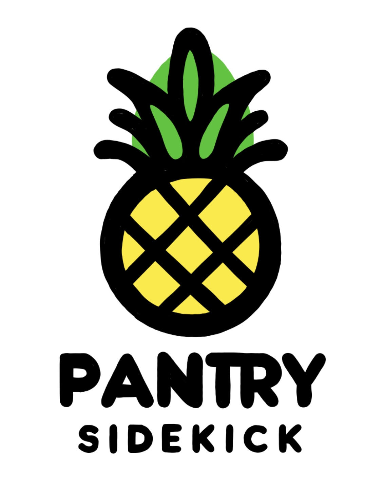

# GIT Hackathon 2024

<table>
  <tr>
    <td></td>
    <td>
      <h2>Pantry Sidekick</h2>
      Welcome to Pantry Sidekick, your ultimate pantry management web application. Designed to streamline the way you manage fruits and vegetables in your home, Pantry Sidekick leverages cutting-edge technology to deliver a seamless and intuitive user experience. Our application utilizes Python, Flask, HTML, and CSS, along with the powerful YOLOv8 model from Ultralytics and a custom dataset trained using Roboflow for accurate visual recognition of your pantry items. With Pantry Sidekick, managing your pantry has never been easier and more sustainable!
    </td>
  </tr>
</table>

## Inspiration
The astonishing fact that Canadians wasted over 500 million dollars worth of food due to expiring products in 2022 shocked us. It motivated us to contribute to the UN's 12th Sustainable Development Goal - Responsible Consumption and Production. We created Pantry Sidekick to help users manage their food items sustainably by tracking expiration dates and reducing waste.

## What it does
Pantry Sidekick recognizes pantry items using image recognition technology and tracks the expiry dates. It aids users in efficiently determining which items are nearing expiration, promoting responsible consumption.

## How we built it
We developed Pantry Sidekick with a combination of technologies:

- **Image Recognition**: The YOLOv8 model, customized with our dataset, is used for scanning and identifying food items.
- **Backend**: We chose Python and Flask for our server-side operations with SQLite managing our data storage.
- **Frontend**: HTML, CSS, JavaScript, and Bootstrap 4 were utilized to craft our user interface. Additionally, Adobe Fresco and Adobe Firefly helped create our app's logo and thematic background images.

## Challenges we ran into
From finding a dataset for training our model to creating our own with Roboflow, our journey was riddled with challenges. We also implemented strict version control to minimize merge conflicts, allowing us to focus on integrating our dataset and developing the app.

## Accomplishments we're proud of
We take pride in crafting a fully functional app with precise image detection and an expiration tracking system. It's an application that echoes our drive for sustainability.

## What we learned
The value of food and its conservation has been a key takeaway from this project, underscoring the gravity of food wastage globally.

## What's next for Pantry Sidekick
We aim to implement a notification system with Twilio API to alert users of impending expiries. We also plan to introduce a feature to suggest recipes based on available pantry items, promoting culinary diversity and furthering our reach.

## Demo
Watch our application in action in the demo video below to see how Pantry Sidekick can transform your pantry management experience:

https://github.com/Reyhan-Sam/ML-Food-Waste-Management-Recognition/assets/81526349/f6a063f0-7064-45d3-8676-9d05948558f3


## Features

- **Visual Recognition**: Instantly recognize fruits and vegetables using the advanced YOLOv8 model, simplifying the process of adding items to your pantry.
- **Expiry Date Tracking**: Keep track of the expiry dates for each item, allowing you to consume them in an efficient manner and minimize waste.
- **User-Friendly Interface**: Navigate through the app with ease thanks to our straightforward and intuitive design.

## Tech Stack

- **Frontend**: HTML, CSS for a sleek and responsive design, enhanced with Bootstrap for styling and components.
- **Backend**: Python with Flask, providing a robust and scalable framework.
- **Database**: SQLite for efficient data storage and retrieval.
- **Machine Learning**: YOLOv8 from Ultralytics, for cutting-edge visual recognition capabilities, with a custom dataset trained using Roboflow.

## Getting Started

### Prerequisites

Before you begin, ensure you have the following installed:
- Python 3.8 or newer
- Flask
- SQLite

### Installation

Follow these simple steps to get Pantry Sidekick up and running on your local machine:

1. Clone the repository:
```bash
  git clone https://github.com/Reyhan-Sam/Pantry-SideKick.git
```

2. Navigate to the project directory and install the required dependencies:
```bash
  cd pantry-sidekick
  pip install -r requirements.txt
```

3. Set up the Flask application:
```bash
  export FLASK_APP=app.py
```

4. Initialize the database:
``` bash
  flask shell
  from app import db
  db.create_all()
  exit()
```

5. Start the Flask server:
```bash
  flask run
```

6. Open your browser and navigate to http://127.0.0.1:5000/ to start using Pantry Sidekick!

